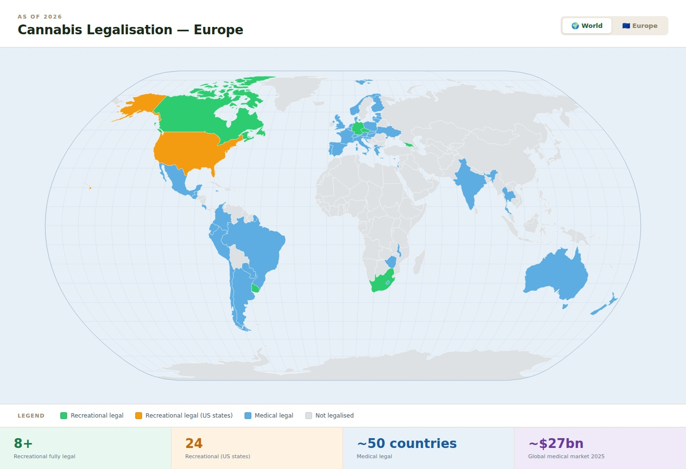
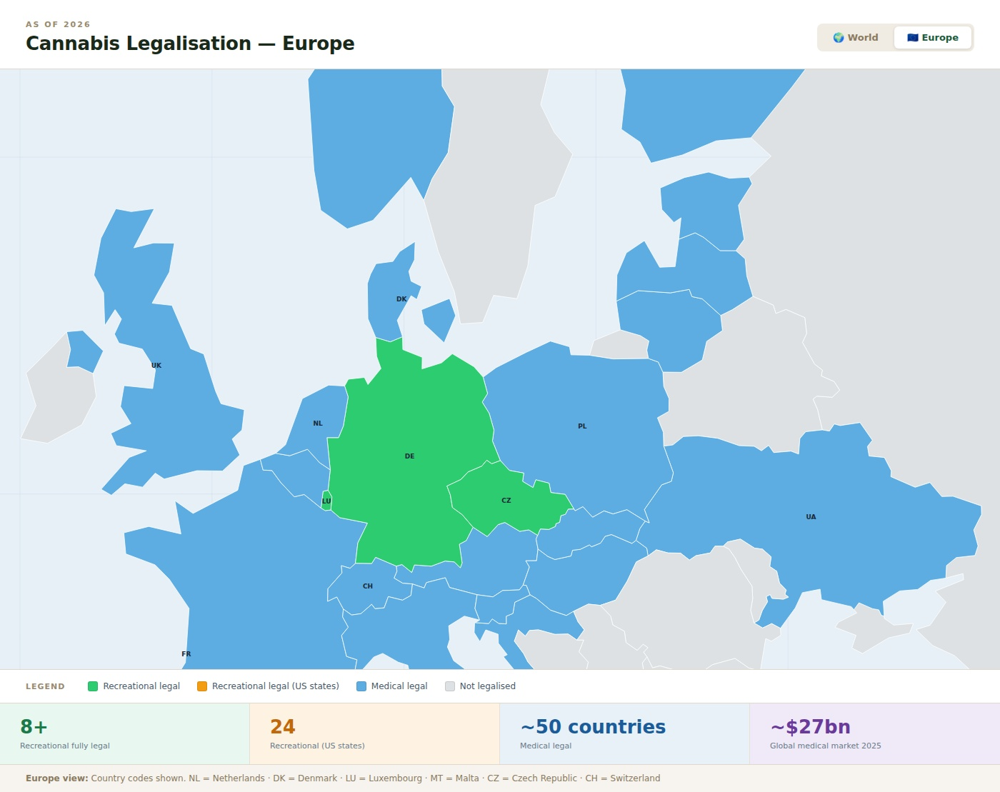
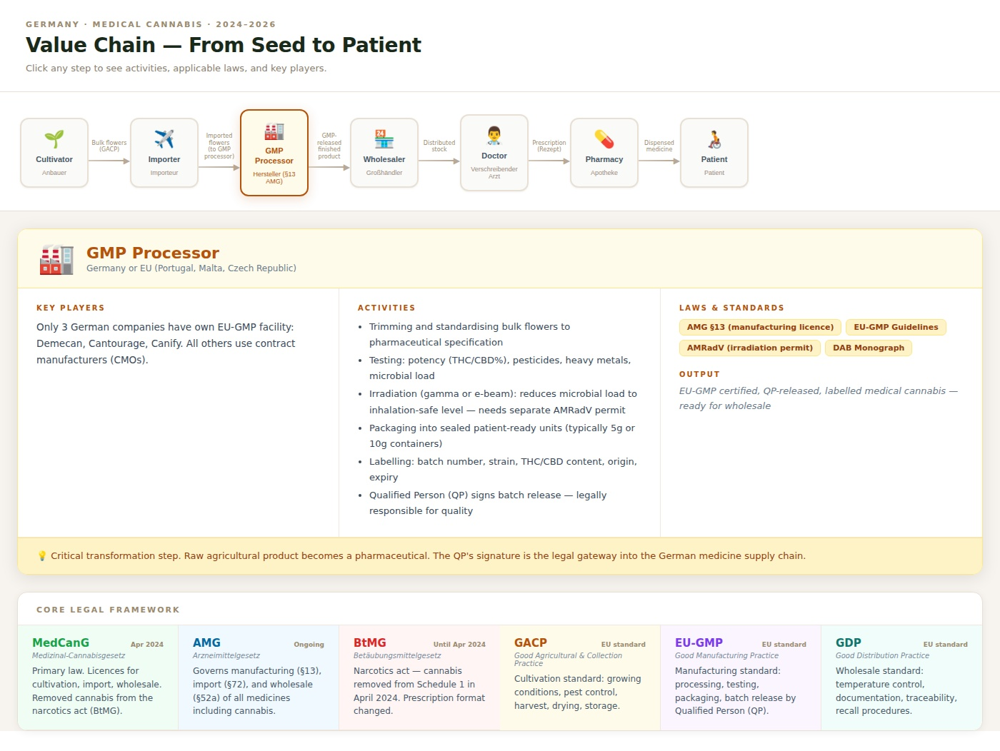

# Cannabis Market: Global, Europe & Germany — Company Profiles 2024–2026

> **As of:** May 2026 | Sources: Company disclosures, Handelsblatt, Pharmazeutische Zeitung, Prohibition Partners, Statista, stock exchange reports  
> **Note:** Figures without a stated year or with unclear dating have been omitted. Projections and forecasts are labelled as such.

---

## Part 1: Global Market

### Global Regulatory Status (2025/2026)

| Category | Countries | Examples |
|---|---|---|
| Recreational fully legal | ~8 | Canada, Uruguay, Germany, Malta, Luxembourg, Czech Republic, Georgia, South Africa |
| Recreational legal (sub-national) | 1 (federal) | USA: 24 states with legal recreational markets; federally still illegal |
| Medical legal (established) | ~50 | UK, Australia, Israel, Netherlands, Italy, France, Poland, Spain (from Oct 2025) |
| Decriminalised | ~30 | Portugal, Netherlands (personal use), Jamaica, and others |
| Illegal | Majority | Most of Asia, Middle East, Africa (exceptions above) |

> **Interactive visual** [available](./cannabis_world_map.html) for more details on other value chain roles

### Global Market Revenue

| Year | Revenue (medical cannabis) | Growth |
|---|---|---|
| 2024 | ~$22–25 bn USD | – |
| 2025 | ~$27–31 bn USD | ~+15–25% (varies by source) |
| 2033 (forecast) | $130–159 bn USD | CAGR ~22% p.a. |

*Note: Research firms (Statista, IMARC, MarketDataForecast) differ considerably in methodology. Consensus range for 2025: $21–37 bn USD. Core message: strong growth is certain.*

### Leading Countries Worldwide

**1. USA — Largest Single Market**

| Metric | Value |
|---|---|
| Regulation | Medical: 38 states; Recreational: 24 states; federally illegal |
| Revenue 2025 (medical) | ~$14.97 bn USD (Statista) |
| North America market share | >45% of global revenue |
| Registered patients (2024) | >5 million |

**2. Canada — Most Mature Overall Market**

| Metric | Value |
|---|---|
| Regulation | Fully legal (recreational + medical) since October 2018 |
| Revenue 2025 (total) | ~5.7 bn CAD (~€3.8 bn) |
| Distinction | First G7 nation with full legalisation; major global exporter (Tilray, Aurora, Canopy) |

---

## Part 2: European Market

### European Regulatory Status

| Country | Medical | Recreational | Notes |
|---|---|---|---|
| **Germany** | Legal since 2017; removed from narcotics act Apr 2024 | Social clubs + home cultivation (Apr 2024) | Largest EU market |
| **UK** | Legal since 2018 | Illegal | Second-largest European market |
| **Netherlands** | Legal (state programme since 2000) | Tolerated (coffeeshops); pilot since Apr 2025 | Oldest European programme |
| **Italy** | Legal since 2013 | Illegal | State cultivator (IMFF) |
| **France** | Regular programme since Mar 2024 | Illegal | Pilot programme 2021–2024 |
| **Spain** | Legal since Oct 2025 | Illegal (social clubs tolerated) | Most recent legalisation |
| **Poland** | Legal since 2017 | Illegal | Fast-growing market |
| **Denmark** | Legal since 2018 | Illegal | Recreational pilot programme |
| **Switzerland** | Legal | Recreational pilot ongoing | Results expected 2026 |
| **Malta** | Legal | Fully legal (2021) | First EU nation for recreational |
| **Luxembourg** | Legal | Home cultivation/possession legal (2023) | No commercial market |
| **Ukraine** | Legal since Aug 2024 | Illegal | Significant emerging market |

### European Market Revenue

| Year | Revenue (medical cannabis, Europe) | Growth |
|---|---|---|
| 2023 | ~€516 m (Prohibition Partners) | – |
| 2024 | ~€1.0–1.5 bn | ~3x vs. 2023 |
| 2025 | ~€1.5 bn (Prohibition Partners) | Further doubling |
| 2027 (forecast) | ~€2.5 bn | CAGR ~50% (2023–2027) |

### Leading Individual Countries in Europe

**1. Germany — Largest European Market**

| Metric | Value |
|---|---|
| Regulation | Medical since 2017; MedCanG (removed from BtMG) since April 2024 |
| Revenue 2025 | ~$977 m / ~€1 bn (Prohibition Partners) |
| Forecast 2026 | ~$1.42 bn |
| Import volume 2024 | 72 tonnes (+120% vs. 2023) |
| Import volume 2025 | ~140 tonnes (annual estimate) |
| EU market share | ~40–50% of all EU imports (2026) |
| Prescriptions (Dec 2025) | +3,300% vs. March 2024 |

**2. UK — Second-Largest European Market**

| Metric | Value |
|---|---|
| Regulation | Medical legal since November 2018 (private prescription) |
| Revenue 2026 (forecast) | ~£297.9 m (~€350 m) |
| Patients 2024 | ~63,000 |
| Patients 2028 (forecast) | ~140,000 |
| Revenue 2028 (forecast) | ~€535 m |
| Notes | 2024 imports more than doubled vs. 2023; strong growth despite no public reimbursement pathway |

---

### Germany in Detail

| Metric | 2023 | 2024 | 2025 |
|---|---|---|---|
| Import volume (DE) | 32 t | 72 t | ~140 t (annual estimate) |
| Specialised pharmacies | ~50 | ~250 | 250+ |
| Average price/gram | ~€9.98 | ~€9.06 (Nov: €8.35) | Continuing to fall |
| Market volume (DE) | n/a | n/a | ~€1 bn |
| Prescriptions (indexed) | Baseline | +1,000% (Dec vs. Jan) | +3,300% vs. Mar 2024 |

*Key driver: The MedCanG came into force on 1 April 2024 — cannabis was removed from the narcotics act (BtMG), enabling any doctor to prescribe it like a standard medication.*

---

## Part 4: The Medical Cannabis Value Chain in Germany

> **Interactive visual** [available](./cannabis_value_chain.html) for more details on other value chain roles

Medical cannabis in Germany passes through seven distinct roles before reaching a patient. Each role requires specific licences, operates under its own regulatory framework, and adds a defined step of value or compliance. The chain is heavily regulated at every handover point, and a product cannot legally advance to the next stage without the previous stage's documentation being complete.

---

### Step 1 — Cultivator (*Anbauer*)

**Licence required:** MedCanG §4 cultivation permit, issued by BfArM. Separately, a manufacturing permit under AMG §13 for any on-site processing.

- Cultivation must comply with **GACP** (Good Agricultural and Collection Practice), which governs growing conditions, pest management, harvest procedures, trimming, drying, and initial storage. The German Pharmacopoeia's Cannabis Flower Monograph (DAB) defines quality benchmarks for THC/CBD ratios, moisture content, and microbial limits that must be met.
- Each cannabis cultivar (strain/phenotype) must be individually approved by BfArM before it can be sold. This approval process — which assesses genetic consistency, potency, and quality — can take months and is a significant barrier to rapidly expanding a product range.
- In Germany, only three licensed production facilities currently exist: **Demecan** (Ebersbach/Saxony), **Aurora** (Leuna/Saxony-Anhalt), and **Tilray** (Neumünster/Schleswig-Holstein). Together they produce roughly 4–5 tonnes per year — approximately **3% of Germany's total 2025 demand**. The remaining ~97% is imported.

---

### Step 2 — Importer (*Importeur*)

**Licence required:** AMG §72 import permit (per product and country of origin), plus a MedCanG §4 permit for wholesale handling.

- Every import shipment from a non-EU country requires proof that cultivation followed **GACP** and that all subsequent processing and testing followed **EU-GMP**. If the foreign producer only holds GACP certification — which is common for raw bulk flowers from Canada or Portugal — the product cannot yet be sold in Germany as a medicine. It must first be routed through a GMP processor (see Step 3).
- A **Qualified Person (QP)** based in Germany must formally release each imported batch. The QP is legally responsible for confirming that the product meets all quality and regulatory requirements. Without a QP signature, no batch can enter the German pharmaceutical supply chain.
- The classification of cannabis as an "active pharmaceutical ingredient" (API) versus a "finished medicinal product" varies by federal state (*Bundesland*), which determines whether EU-GMP certification is required at import or only after processing. This inconsistency is a known compliance complexity across Germany's decentralised regulatory structure.

---

### Step 3 — GMP Processor / Manufacturer (*Hersteller*)

**Licence required:** AMG §13 manufacturing permit, issued by the relevant state authority. Additional AMRadV permit required for irradiation.

- This is the step that legally converts a raw agricultural commodity into a pharmaceutical product. Processing includes: standardisation of flower material to consistent pharmaceutical grade, laboratory testing for potency (THC/CBD%), pesticide residues, heavy metals, microbial contamination, and aflatoxins. All test results must meet the DAB monograph thresholds.
- **Irradiation** (gamma or electron beam) is the standard method for reducing microbial load — airborne mould spores in particular — to levels safe for inhalation. This step requires a separate permit under the *AMRadV* (Regulation on Radioactive or Ionising Radiation-Treated Medicinal Products). The irradiation process itself must be validated and the irradiating facility must hold a current EU-GMP certificate.
- After testing and irradiation, flowers are weighed, portioned into sealed pharmaceutical containers (typically 5 g or 10 g), labelled (batch number, strain, THC/CBD content, origin, expiry), and formally batch-released by the **Qualified Person (QP)**. The QP's signature is the legal gateway into the German medicine supply chain. Only three German companies — **Demecan**, **Cantourage**, and **Canify** — operate their own EU-GMP processing facility. All other wholesalers outsource this step to contract manufacturers (CMOs), typically in Portugal, Malta, the Czech Republic, or Canada. This outsourced processing is informally referred to as **"GMP washing"** in the industry and is under increasing regulatory scrutiny.

---

### Step 4 — Wholesaler (*Großhändler*)

**Licence required:** AMG §52a wholesale distribution permit. **GDP** (Good Distribution Practice) certification required.

- Wholesalers source GMP-released, QP-approved product and distribute it to pharmacies across Germany. They must maintain temperature-controlled storage, complete chain-of-custody documentation for every batch, and be capable of executing a product recall within defined timeframes. GDP audits are conducted by state authorities.
- In practice, the boundaries between importer, GMP processor, and wholesaler are often collapsed within a single company. Cansativa, for instance, holds all three licences and acts as a one-stop distribution platform for pharmacies — covering import, processing (via contract manufacturers), warehousing, and delivery. Cantourage and Canify additionally own their own GMP facilities.
- Market concentration is significant: the top five wholesalers account for the majority of pharmacy supply. Smaller wholesalers tend to specialise in niche products (e.g. specific countries of origin, high-THC varieties) or serve regional pharmacy clusters.

---

### Step 5 — Prescribing Doctor (*Verschreibender Arzt*)

**Applicable law:** MedCanG, AMG, SGB V §31 (statutory health insurance reimbursement).

- **Before April 2024**, prescribing cannabis required a special orange *BtM-Rezept* (narcotic prescription form), typically involved specialist referral, and was subject to strict insurer pre-approval — a process that often took weeks. **Since April 2024**, any licensed German physician can prescribe cannabis on a standard pink prescription (the same form used for antibiotics or blood pressure medication), with no prior specialist involvement or insurer approval needed for the prescription itself.
- The choice of product is usually specified by the doctor: strain, approximate THC/CBD ratio, and maximum quantity (typically up to a 30-day supply). Telemedicine platforms have made the consultation step accessible within hours — a patient can go from enquiry to prescription the same day via platforms like Bloomwell or Grünhorn's CanDoc.
- **Reimbursement** is split: private prescriptions are paid in full by the patient at point-of-dispensing (€8–12/gram typically). Statutory (GKV) reimbursement requires the patient to apply to their insurer, who approves case-by-case. GKV approvals have increased since 2024 but remain inconsistent across insurers.

---

### Step 6 — Pharmacy (*Apotheke*)

**Applicable law:** ApBetrO (Pharmacy Operations Ordinance), AMG, MedCanG.

- Pharmacies receive QP-released product from a licensed wholesaler and dispense it directly to patients against a valid prescription. Critically, **pharmacies cannot repackage cannabis** — product must be dispensed in the original sealed GMP container from the manufacturer. Opened or partially used packs cannot be returned; unsold surplus must be destroyed, not returned to the wholesaler.
- A licensed pharmacy may also produce cannabis preparations in-house under AMG §21(2), including cannabis extracts and oil infusions — this is treated as a *magistral* (compounded) preparation and is exempt from the standard manufacturing authorisation requirement. This pathway allows pharmacies to offer customised formulations not available commercially.
- The pharmacy sector has bifurcated sharply since 2024: ~250 pharmacies now specialise in cannabis (April 2025, up from ~50 in April 2024), offering broad strain selection, clinical counselling, and integration with telemedicine platforms. Mail-order (Versandapotheke) dominates patient volume, enabling nationwide access from a small number of high-volume dispensaries.

---

### Step 7 — Patient (*Patient*)

**Applicable law:** MedCanG, SGB V §31, GKV-SG.

- Germany had approximately **900,000 medical cannabis patients by end of 2025**, up from a much smaller base before the April 2024 reform. The dominant indication is **chronic pain** (estimated 70%+ of prescriptions), followed by sleep disorders, anxiety, multiple sclerosis, and oncology-related symptoms.
- Patients primarily consume via **vaporiser** (the clinically preferred method for flowers, as it avoids combustion byproducts) or via **oral preparations** (oils, capsules). A standard starting dose is 0.1 g per vaporiser session; typical monthly use is 20–30 g of flowers, costing €160–360 on a private prescription.
- The **regulatory risk for patients** in 2026 is the proposed MedCanG amendment, which would require an in-person first consultation and ban mail-order of cannabis flowers. If enacted, this would eliminate the telemedicine-only prescription model and require patients — including those in rural areas — to visit a physical practice before access.

---

### Value Chain Summary

| Step | Role | Key Licence | Critical Quality Standard | Bottleneck |
|---|---|---|---|---|
| 1 | Cultivator | MedCanG §4 | GACP + DAB Monograph | BfArM cultivar approval time |
| 2 | Importer | AMG §72 | GACP + EU-GMP (at origin) | QP batch release; state-level classification variance |
| 3 | GMP Processor | AMG §13 + AMRadV | EU-GMP; irradiation validation | Few in-house EU-GMP facilities in Germany |
| 4 | Wholesaler | AMG §52a | GDP | Market concentration; documentation burden |
| 5 | Doctor | MedCanG / AMG | n/a | Reimbursement inconsistency (GKV) |
| 6 | Pharmacy | ApBetrO / AMG | n/a | No returns; mail-order ban risk |
| 7 | Patient | SGB V §31 | n/a | Private cost; insurer approval variability |

---

## Comparison Table: Wholesalers & Producers

| | **Cansativa** | **Demecan** | **Cannamedical** | **Cantourage** |
|---|---|---|---|---|
| Founded | 2017 | 2017 | 2016 | 2019 |
| HQ | Mörfelden-Walldorf | Ebersbach/Saxony | Cologne | Kleinmachnow/Berlin |
| Focus | Wholesale/Platform | Cultivation + Wholesale | Import + Wholesale | Production + Distribution |
| Revenue 2023 | €17 m | Not disclosed | Not disclosed | €23.6 m |
| Revenue 2024 | Target: ~€30 m | Not disclosed | Not disclosed | **€51.4 m** |
| Revenue 2025 | n/a | Not disclosed | Not disclosed | **€92.8 m** (preliminary) |
| Employees | n/a | ~120 (Jan 2026) | ~50 (2023) | n/a |
| Listed | No | No | No | **Yes** (since Dec 2022) |
| Total funding | ~€13 m (Series B) | ~€22 m (5 rounds) | ~€15 m (Orkila, 2019) | Exchange-funded |
| EU-GMP facility | No | **Yes** | No | **Yes** |
| Market share | ~25% (2023) | Small | ~25% (self-reported, 2023) | Growing |

---

## Comparison Table: Online Platforms & Telemedicine

| | **Grünhorn** | **DrAnsay** | **Bloomwell** |
|---|---|---|---|
| Founded | 2020 (Leipzig) | ~2022 (Hamburg/Malta) | 2020 (Frankfurt) |
| Model | Fully integrated | Pure platform | Holding + Telemedicine |
| Patients | 73,000 (2024) | >1 m treated (Feb 2025) | Tens of thousands/month |
| Strength | Germany's largest cannabis pharmacy + wholesale | Questionnaire prescription, price | eRx pioneer, data assets |
| Prescription fee | Via CanDoc | €18 (first & repeat) | €25–70 first consultation |
| Rating | n/a | 4.8 Google / 4.7 Trustpilot | n/a |
| Regulatory risk | Medium | **High** (grey zone) | Medium |
| Funding | n/a | n/a | >$10 m seed (Oct 2021) |

---

## Individual Profiles

---

### 1. Cansativa Group (Mörfelden-Walldorf)

**Type:** Pharmaceutical wholesaler, B2B platform  
**Founded:** 2017 by brothers Jakob and Hermann Sons  
**HQ:** Mörfelden-Walldorf, near Frankfurt

#### Financials (year-verified)
- **2023:** Revenue €17 m; >3,000 kg distributed to >2,500 pharmacies
- **H1 2024:** >€11 m revenue
- **2023:** >400,000 patients supplied, 75% in pain therapy
- **2023:** Market share >25%, >420 SKUs, >40 international suppliers, >2,000 active customers

#### Funding
- **2022:** Series B — €13 m from Casa Verde Capital (US, lead), Argonautic Ventures, Alluti Family Office
- Earlier rounds: Seed + Series A (seven-figure, 2021)

#### Key Facts
- Exclusive distribution rights for German-grown cannabis (BfArM mandate since 2020)
- Positions itself as the "Amazon of medical cannabis"
- GMP- and GDP-certified
- 11 shareholders (as of Feb 2026, commercial register)

#### Assessment
Market leader in wholesale. Solid revenue base, but no public 2025 figures. Pricing pressure from falling market prices and new entrants is a growing risk.

---

### 2. Demecan (Ebersbach near Dresden)

**Type:** Germany's only independent cannabis producer + wholesaler  
**Founded:** 2017 by Dr. Adrian Fischer, Dr. Cornelius Maurer, Dr. Constantin von der Groeben  
**HQ:** Ebersbach, Saxony (production site: ~100,000 sqm)

#### Financials (year-verified)
- No specific revenue figures publicly available (GmbH, no disclosure obligation)
- **From April 2024:** Strong revenue growth reported (no figure stated)
- **H1 2025:** Revenue more than doubled vs. same period prior year (company statement, Aug 2025)
- **2025:** Annual production reached 2 tonnes for the first time
- **Jan 2026:** Cultivation capacity doubled to ~4,000 kg/year; total site investment: €23 m

#### Employees
- **2023:** ~98 employees (including 17 in-house dogs)
- **Jan 2026:** ~120 employees

#### Funding
- **5 rounds total, ~€22 m through 2022**
- Series A (Oct 2019): €7 m
- Series B (Dec 2022): €15 m (Futury Growth/Venture, btov, MBG Saxony, Enexis)
- Public subsidy: €6.65 m (GRW regional economic development grant)
- Loan from Volksbank Mittweida: single-digit millions (2021)

#### Key Facts
- **July 2024:** First German company to receive a cultivation licence under the new MedCanG
- One of three companies in Germany with its own EU-GMP processing facility
- Full value chain coverage (cultivation → processing → storage → pharmacy delivery)
- **Management changes 2025:** Philipp Goebel (Oct 2025) and Jörg Sellmann (Jul 2025) no longer serving as managing directors

#### Assessment
Strategically unique as a genuine producer — but smaller than pure distributors. H1 2025 revenue growth is strong; absolute figures unavailable. Regulatory risk: proposed MedCanG tightening (restrictions on mail-order) could affect the market.

---

### 3. Cannamedical Pharma (Cologne)

**Type:** Pharmaceutical wholesaler and importer  
**Founded:** 2016 by David Henn  
**HQ:** Cologne; part of the **Semdor Pharma Group** (since 2021)

#### Financials (year-verified)
- No current specific revenue figures publicly available
- **2020:** Revenue in the double-digit millions; ~50 employees
- **2023:** Market share ~25% (self-reported); >3,000 pharmacies supplied
- IPO plans with JP Morgan & Berenberg (target: 2024/2025) — **not executed**
- Valuation 2023: €200 m (on €85 m equity)

#### Funding
- **2019:** Orkila Capital (US private equity) invests €15 m
- Other investors: Justin Hartfield, Steve Wiggins, Bernhard Maier

#### Supply Chain
- Imports from Netherlands, Canada, Portugal, Australia
- GDP- and GMP-certified
- Focus: pain therapy

#### Assessment
Established pioneer (since 2016), but limited public data. No IPO, no new public funding rounds. Embedded within the Semdor group. IPO ambitions not yet realised.

---

### 4. Cantourage Group SE (Kleinmachnow near Berlin)

**Type:** Pharmaceutical producer and distributor; publicly listed  
**Founded:** 2019  
**HQ:** Kleinmachnow near Berlin  
**Exchange:** Scale segment, Frankfurt (since Dec 2022), ISIN: DE000A3DSV01

#### Financials (year-verified) — Best data transparency in the sector

| Period | Revenue | Growth |
|---|---|---|
| 2023 | €23.6 m | – |
| 2024 | **€51.4 m** | +118% |
| 9M 2025 | €75 m | +148% vs. prior year period |
| 2025 (preliminary) | **€92.8 m** | ~+80% |

- **Oct 2024:** Monthly revenue record: €5.5 m
- **Q3 2024:** EBITDA +€1.4 m (vs. -€0.7 m in Q3 2023) → operationally profitable
- **Market capitalisation:** ~€54–63 m (2025)

#### Key Facts
- Germany's only listed cannabis company
- One of three companies in Germany with its own EU-GMP processing facility (alongside Demecan and Canify)
- Exporting to Poland since 2024; international expansion across further EU countries
- **CEO change 2025:** Philip Schetter temporarily unable to serve; Patrick Hoffmann (co-founder) steps in as interim

#### Assessment
By far the most transparent data situation due to its listing. Strongest revenue growth in the market. Operational profitability (EBITDA) achieved. High growth in a structurally young market carries dependence on regulatory conditions.

---

### 5. Bloomwell Group (Frankfurt)

**Type:** Holding company for medical cannabis businesses; D2C + telemedicine  
**Founded:** June 2020 (as Algea Health GmbH)  
**HQ:** Frankfurt am Main  
**CEO:** Niklas Kouparanis (serial founder)

#### Portfolio Companies
- **Algea Care / Bloomwell:** Telemedicine platform (Europe's leading cannabis telemedicine provider)
- **Ilios Santé:** Importer and distributor
- **Breezy:** D2C brand for the recreational cannabis market

#### Financials (year-verified)
- **Oct 2021:** >160 employees; revenue projection of €5 m for 2021
- **From April 2024:** Revenue tripled vs. months prior to reclassification (Kouparanis, July 2024)
- Current employee count: last communicated as "250+" — date of this figure unclear, likely 2022/2023

#### Funding
- **October 2021:** Seed round >$10 m USD — highest publicly known seed investment in a European cannabis company at the time
- Lead investor: Measure 8 Venture Partners (USA); co-investor: M4 Capital

#### Digital Infrastructure
- eRx with qualified remote signature (D-Trust / Federal Printing Office)
- Tens of thousands of patients, pharmacies, doctors and wholesalers on the platform monthly
- Knowledge base: >8,000 documented cannabis treatment journeys

#### Market Data (Bloomwell's own reports)
- **Feb 2026 (Cannabis Barometer):** Prescriptions Mar 2024–Dec 2025: +3,300%
- **Nov 2024:** Average price €8.35/g (vs. €9.27/g in Jan 2024)

#### Assessment
Strongest strategic differentiator: the only fully D2C-oriented company with a data advantage from treatment histories. Revenue figures not publicly disclosed. The "250 employees" figure is hard to contextualise without a clear date.

---

### 6. Grünhorn Group (Leipzig)

**Type:** Fully integrated cannabis group (pharmacy + wholesale + telemedicine)  
**Founded:** 2020  
**HQ:** Leipzig, Saxony

#### Group Structure
- **Grünhorn Pharmacy:** Germany's largest cannabis mail-order pharmacy
- **Schurer Pharma & Kosmetik GmbH:** Automated fulfilment and logistics
- **canymed GmbH:** Pharmaceutical wholesaler and manufacturer
- **CanDoc:** Digital telemedicine platform

#### Financials (year-verified)
- **2024:** 73,000 patients supplied
- **2023→2024:** German import volume +120% (32 t → 72 t, proprietary market data)
- **Apr 2024→2025:** Specialised pharmacies: ~50 → 250+
- **Nov 2024:** Cheapest cannabis at €3.99/g; market average €8.35/g

#### Key Facts
- Board member of the BPC (Federal Association of Pharmaceutical Cannabinoid Companies, since Nov 2024)
- Publishes proprietary market research (study of 3,000 patients: advantages vs. opioids)
- Visit by Saxony's Premier Michael Kretschmer (CDU) in Leipzig (2025)
- Self-described as "Germany's largest cannabis group"

#### Assessment
Strategically compelling through full vertical integration. Stronger than a pure wholesaler, as the in-house pharmacy creates direct customer relationships. Financial KPIs not publicly disclosed.

---

### 7. DrAnsay (Hamburg / Malta)

**Type:** Pure telemedicine and pharmacy marketplace platform  
**Operator:** DrAnsay AU-Schein GmbH (Germany) + Dr. Ansay Ltd. (Malta)  
**Marketplace launch:** 2022

#### Key Metrics (year-verified)
- **Feb 2025:** >1 million patients treated
- **Google rating:** 4.8/5 (from 4,388 reviews, May 2024–Apr 2026)
- **Trustpilot:** 4.7/5 (from 2,368 reviews, May 2024–Apr 2026)
- **Assortment:** >800 cannabis strains from >200 partner pharmacies
- **Prescription fee:** €18 (first and repeat)
- **Jan 2025:** Top partner pharmacy generated ~€2 m in medical cannabis revenue in January alone

#### Business Model
- No own inventory, no own pharmacy
- Prescription via online questionnaire (video consultation not mandatory)
- Referral to chosen pharmacy; pharmacy participation is free
- Platform earns through prescription fees and potentially marketing arrangements

#### Regulatory Risk ⚠️
- **July 2025:** Draft amendment to MedCanG: prescribing cannabis flowers to require in-person doctor–patient contact
- Questionnaire model without video consultation potentially faces extinction
- Legal grey zone: pharmacies cooperating with questionnaire-based platforms may be liable under criminal law (Deutsche Apotheker Zeitung, Jan 2026)

#### Assessment
Highest reach of any platform player (>1 m patients). Lowest price in the market. However, the highest regulatory risk of all companies analysed. The proposed MedCanG tightening could directly threaten the core product.

---

## Industry Outlook 2026

| Topic | Development |
|---|---|
| Pricing pressure | Structural oversupply continues to push prices down |
| Regulation | MedCanG amendment (CDU Health Minister Warken): plans to ban mail-order of cannabis flowers and mandate in-person first contact |
| Imports | Still dominant; German domestic production (Demecan, Tilray, Aurora) covers ~3% of total demand |
| Telemedicine | ~35 active telemedicine clinics in Germany (Feb 2026); consolidation expected |
| Market volume (DE) | 2025: ~€1 bn; 2026: potential ≥€1.5 bn under stable regulation |

---

---

## Top 10 Sources

1. **Prohibition Partners** — *The European Cannabis Report* (9th Edition, 2024) and Germany Market Intelligence Hub. Primary source for European and German market sizing, import volumes, and revenue forecasts for 2023–2026. URL: prohibitionpartners.com

2. **BfArM — Bundesinstitut für Arzneimittel und Medizinprodukte** — Official data on German cannabis import volumes, cultivation licence holders, and the Cannabis Agency (Cannabisagentur). Primary regulatory authority for MedCanG enforcement. URL: bfarm.de

3. **Cannabis Europa** — *Germany Cannabis Legalisation: The Business Guide 2026* and *European Cannabis Regulations by Country: The 2026 Business Guide*. Detailed regulatory framework analysis covering GACP, EU-GMP, and country-by-country legal status. URL: cannabis-europa.com

4. **Cantourage Group SE** — Quarterly and annual revenue disclosures via EQS Group press releases (Jan 2025, Mar 2026) and stock exchange filings (ISIN DE000A3DSV01). Only publicly listed German cannabis company; provides the sector's most transparent financial data. URL: cantourage.com

5. **Cansativa Group** — *Media Kit 2024* (internal document, publicly available PDF). Source for 2023 revenue (€17 m), patient numbers (400,000+), pharmacy count (2,500+), SKU count, and market share figures. URL: cansativa.de

6. **Stratcann** — *Canada continued to supply bulk of German medical cannabis imports in 2025* (Mar 2026) and *Germany's BfArM clarifies cultivar approval as EU-GMP scrutiny increases* (Nov 2025). Key source for import dynamics, GMP washing practices, and BfArM regulatory developments. URL: stratcann.com

7. **Handelsblatt** — Reporting on Cannamedical Pharma IPO plans (Oct 2023) and medical cannabis market revenue growth post-legalisation (Jul 2024). Authoritative German business source for financial figures and executive interviews. URL: handelsblatt.com

8. **Chambers & Partners** — *Medical Cannabis & Cannabinoid Regulation 2024: Germany* (Trends and Developments). Definitive legal analysis of MedCanG, AMG, GACP/EU-GMP requirements, import permit structure, and QP batch release obligations. URL: practiceguides.chambers.com

9. **Pharmazeutische Zeitung / Deutsche Apotheker Zeitung** — Industry reporting on pharmacy sector growth, Demecan cultivation licence (Jul 2024), platform revenue boom (Dec 2024), and regulatory grey-zone analysis of questionnaire-based prescription platforms (Jan 2026). URL: pharmazeutische-zeitung.de / deutsche-apotheker-zeitung.de

10. **Apotheke Adhoc / KrautInvest** — *Demecan verdoppelt Kapazitäten* (Jan 2026) and ongoing industry update series (2023–2025). Source for Demecan employee count (~120, Jan 2026), site investment (€23 m total), capacity expansion, and Bloomwell/Grünhorn market data. URL: apotheke-adhoc.de / krautinvest.de

---

*Report compiled from publicly available sources. All figures are year-dated. Projections and company self-reported data are clearly labelled. Research current as of May 2026.*
